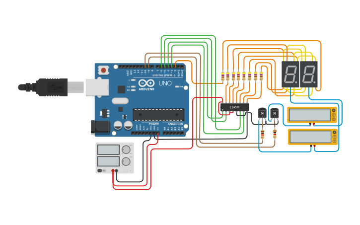

# Temp-Humidity_Monitor

Este Projeto se trata de um Monitor de Temperatura e Umidade que fiz para monitorar o quarto da minha filha.
Foram utilizados para o Projeto:
- 1x DHT11;
- 2x Displays de 7 Segmentos;
- 1x Arduino nano;
- 1x CD4511;
- 8x Resistores de 470Ω;
- 2x Resistores de 1KΩ;
- 1x Resistor de 10kΩ;
- 2x Transistores bc548;

O Protótipo de funcionamento do CD4511 se encontra no Tinkercad no link: https://www.tinkercad.com/things/7Z3mSi3R3jC-7segmultiplex

 O Projeto 3D da caixa foi feito no FreeCAD e usinado em uma CNC Router, com madeira de 10mm e Fresa de 3mm de diâmetro e está disponível no repositório.
 
  
