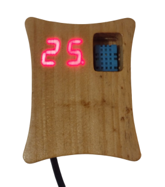
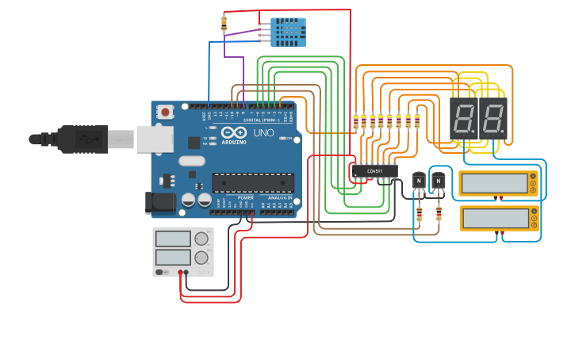
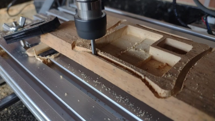
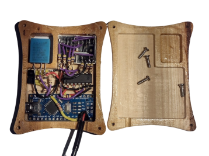
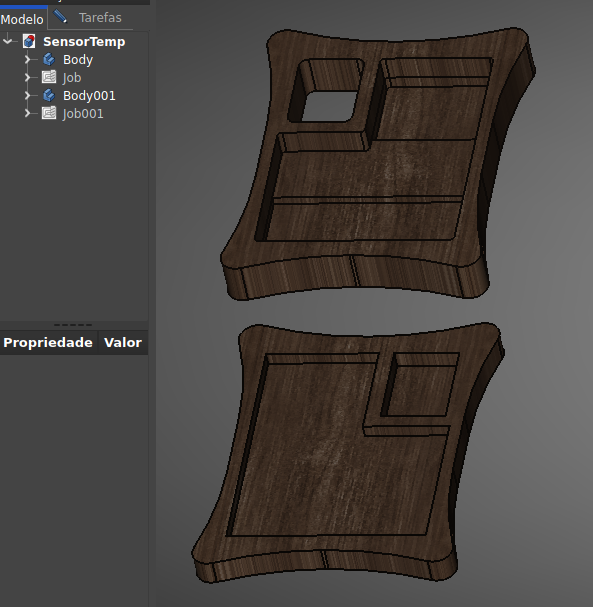

# Temp-Humidity_Monitor

Este Projeto se trata de um Monitor de Temperatura e Umidade que fiz para monitorar cômodos da casa, especialmente o quarto da minha filha quando nasceu.

Os componentes utilizados incluem:
- 1x DHT11;
- 2x Displays de 7 Segmentos;
- 1x Arduino nano;
- 1x CD4511;
- 8x Resistores de 470Ω;
- 2x Resistores de 1KΩ;
- 1x Resistor de 10kΩ;
- 2x Transistores bc548;

O protótipo de funcionamento do CD4511 está disponível no Tinkercad neste [link](https://www.tinkercad.com/things/7Z3mSi3R3jC-7segmultiplex).

 O projeto 3D da caixa foi criado no FreeCAD e usinado em uma CNC Router, utilizando madeira de 10mm e uma fresa de 3mm de diâmetro. O design está disponível no repositório.
 
   
